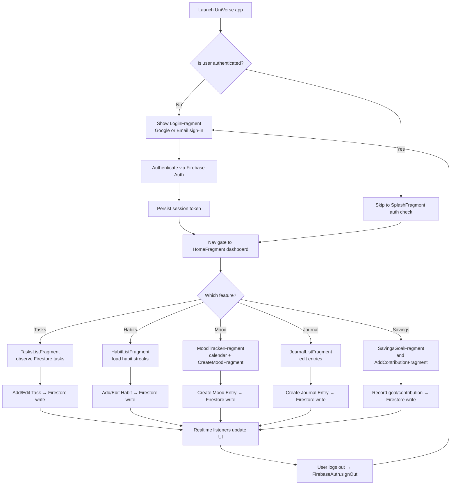
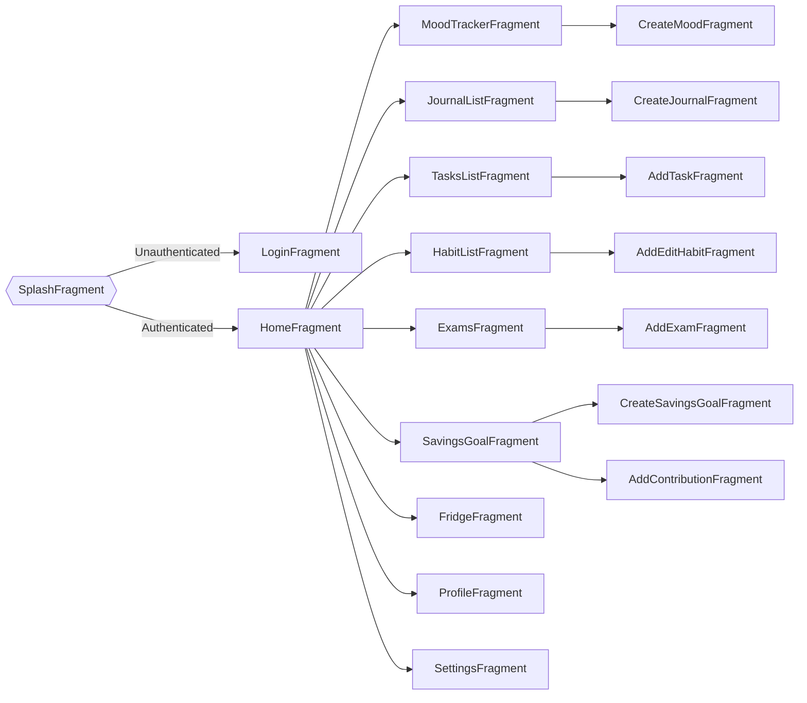
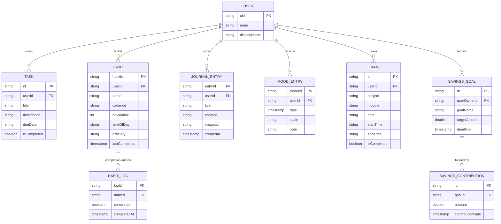

# PROG7314 Part 3 - UniVerse Student Survival App

# Students: ST10321423, ST10083866, ST10260870, ST10039260
# Module: Programming 3D (PROG7314)
# Video Demonstration: https://youtu.be/mg6YbriVZQE

## Overview
UNIverse is a comprehensive Android student companion application designed to help university students manage their academic, personal, and wellness needs in one integrated platform. The app combines modern Android development practices with Firebase backend services to deliver a seamless, secure, and feature-rich experience.

## Vision Statement
UNIverse aims to be more than just a scheduling or reminder app—it's a complete digital survival kit for students, integrating academic success, mental wellness, habit formation, and personal organization into a single, cohesive platform.


## Solution Components
### Frontend (Android)
- Built with Android Studio (Kotlin)
- Activities/fragments with a user-friendly task and habit workflow
- Multi-language ready through Android string resources
- Accessibility-friendly UI with standard components for TalkBack/VoiceOver and sensible contrast defaults
- Real-time data display backed by Firestore listeners

### Backend (Firebase Cloud)
- Firebase Authentication for secure login (Google Sign-In and Email/Password)
- Cloud Firestore for scalable, structured task and habit data
- Real-time synchronization of user data across devices

### Pipeline
- Version control with GitHub
- Local builds and testing through Android Studio
- Ready for GitHub Actions CI/CD automation
- Branching strategy: `main`, `dev`, and `feature/*`

## Security Features
### User Authentication
- Firebase Authentication for Google Sign-In
- Automatic token-based session management

### Password and Account Protection
- Credentials encrypted by Firebase Auth; no plaintext storage
- OAuth2 flow for Google Sign-In

### Data Protection
- Firestore Security Rules restrict access to documents where `userId == request.auth.uid`
- All reads and writes require authenticated sessions

### Input Validation
- Task and habit fields validated before Firestore writes
- Empty or malformed inputs blocked on both frontend and backend

### Protection Against Common Attacks
- HTTPS (TLS) for encrypted transmission
- Firebase infrastructure mitigates XSS, SQL injection, and CSRF
- Firestore rules prevent privilege escalation; auth tokens reduce session hijacking risk

### DevSecOps Pipeline
- GitHub for collaboration and versioning
- Firebase hosting/monitoring for backend components
- Local unit testing before commits; CI pipeline ready for build/test/deploy automation\

#### 3. Biometric Security
```kotlin
// BiometricPrompt implementation
private fun setupBiometric() {
    val executor = ContextCompat.getMainExecutor(requireContext())
    
    biometricPrompt = BiometricPrompt(this, executor,
        object : BiometricPrompt.AuthenticationCallback() {
            override fun onAuthenticationSucceeded(
                result: BiometricPrompt.AuthenticationResult
            ) {
                // Navigate to main app
                goToMain()
            }
            
            override fun onAuthenticationFailed() {
                toast("Authentication failed")
            }
        })
        
    biometricPromptInfo = BiometricPrompt.PromptInfo.Builder()
        .setTitle("Unlock UNIverse")
        .setSubtitle("Authenticate to access your dashboard")
        .setNegativeButtonText("Cancel")
        .build()
}

```

## Core Features

### 1. Authentication & Security
- **Firebase Authentication** with email/password and Google Sign-In
- **Single Sign-On (SSO)** for seamless access across devices
- **Biometric Authentication** (fingerprint/face unlock) for quick, secure access
- Secure session management with automatic token refresh
- POPIA-compliant data handling practices

### 2. Mood Tracking & Mental Wellness
- **Daily Mood Logging** with 5 emotional states (Happy, Sad, Angry, Fear, Disgust)
- **Calendar View** showing monthly mood patterns with emoji indicators
- **Weekly Statistics** displaying mood distribution in bar chart format
- **Mood History** with ability to edit past entries
- Optional notes for each mood entry to capture context
- Real-time sync across devices using Firebase Firestore

**Implementation Highlights:**
```kotlin
// Mood scales supported
enum class MoodScale {
    HAPPY, SAD, ANGRY, FEAR, DISGUST
}

// Features
- Create/Edit moods for any date
- View monthly calendar with mood indicators
- Weekly mood statistics with visual charts
- Firestore collection: "moods"
```

### 3. Journal & Reflection
- **Daily Journal Entries** with title, content, and optional image uploads
- **Firebase Storage Integration** for image attachments
- **Flexible Entry Management:** Multiple entries per day supported
- **Image Compression** using Glide for optimal storage
- **Date-Based Navigation** with calendar integration
- **Rich Text Editor** for detailed journaling

**Key Components:**
- Journal creation with timestamp tracking
- Image upload to Firebase Storage
- View and edit historical entries
- Filter entries by date range

### 4. Habit Tracker
- **Create Custom Habits** with personalized details:
  - Habit name and description
  - Icon selection from predefined set
  - Time of day (Morning, Afternoon, Evening, Night)
  - Specific days of the week
  - Difficulty level (Easy, Medium, Hard)
- **Daily Tracking Dashboard** showing today's habits
- **Progress Visualization** with completion statistics
- **Streak Tracking** to maintain consistency
- **Filter Options** by time of day and weekday

**Architecture:**
```
HabitRepository → MoodViewModel → Fragment UI
Firebase Firestore Collection: "habits"
Real-time updates using Flow API
```

### 5. Class Schedule & Timetable
- **Subject Management** with customizable colors and icons
- **Class/Lecture Scheduling:**
  - Start and end times
  - Location/venue
  - Recurring patterns (weekly, custom days)
- **Weekly Timetable View** displaying all scheduled sessions
- **Conflict Detection** to prevent overlapping classes
- **Quick Access** from home dashboard

### 6. Tasks & Assignments
- **Task Creation** with:
  - Title and detailed description
  - Due dates with time
  - Priority levels (High, Medium, Low)
  - Subject/course association
- **Status Tracking:** Todo, In Progress, Completed
- **Reminder System** with push notifications
- **Sorting & Filtering** by date, priority, or subject
- **Progress Overview** on dashboard

### 7. Savings & Financial Tracking
- **Income & Expense Logging**
- **Category-Based Tracking** (Food, Transport, Books, etc.)
- **Savings Goals** with progress indicators
- **Monthly Budget Overview**
- **Visual Breakdowns** showing spending patterns
- **Currency Support** (ZAR for South African students)

### 8. Fridge & Food Management
- **Inventory Tracking** for fridge items
- **Expiry Date Monitoring** with notifications
- **Shopping List Generation**
- **Waste Reduction** through smart reminders
- **Meal Planning Integration**

### 9. Home Dashboard
- **At-a-Glance Overview** of the day:
  - Today's class schedule (next 3 classes)
  - Current mood status
  - Habit completion progress
  - Upcoming tasks and deadlines
  - Financial snapshot (savings progress)
  - Fridge status summary
- **Quick Navigation Cards** to all major features
- **Search Functionality** for quick access
- **Settings Access** from bottom navigation

---


### Data Model
- **Collection:** `tasks`
- **Fields:**
  - `taskId`: Unique identifier (auto-generated)
  - `userId`: UID of the authenticated user
  - `title`: Task title
  - `description`: Task details
  - `dueDate`: Firestore Timestamp
  - `isCompleted`: Boolean task status

### Core Functions
- `addTask()`: Add a new task for the logged-in user
- `updateTask()`: Update existing task data
- `deleteTask()`: Remove a task from Firestore
- `fetchTasksByUser()`: Retrieve all tasks for a given `userId`
- `syncTasks()`: Keep tasks synchronized in real time with Firestore listeners

### Data Flow
1. Retrieve `currentUser.uid` from Firebase Auth.
2. Query Firestore tasks where `userId == currentUser.uid`.
3. Real-time listeners push add/edit/delete changes to the app instantly.

### Offline Behavior
- Firestore local persistence keeps recent task and habit data available offline and resyncs automatically on reconnect.
- Pending writes queue locally to prevent data loss during connectivity drops.
- UI surfaces cached data first, then refreshes when network connectivity returns.

### Localization and Offline Tips
- **Localization:** Add translated strings to locale-specific `res/values-<lang>/strings.xml` files; Android will auto-select the right language based on the device locale.
- **Right-to-left (RTL) readiness:** Use `Start`/`End` layout attributes and avoid hardcoded alignment to keep RTL layouts usable.
- **Offline UX:** Show cached tasks/habits instantly, then merge server updates when back online. Consider lightweight toasts/snackbars for queued writes and sync status.

## Installation and Running the Project

### Prerequisites

1. **Android Studio** (Hedgehog or later recommended)
   - Download from: https://developer.android.com/studio
   
2. **Java Development Kit (JDK)** 17 or later
   - Comes bundled with Android Studio

3. **Firebase Account**
   - Create at: https://console.firebase.google.com

4. **Android Device or Emulator**
   - Physical device: Android 7.0 (API 24) or higher
   - Emulator: Pixel 5 or similar with Google Play Services

### Clone Repository
```bash
git clone https://github.com/VCDN-2025/prog7314-poe-part-3-ST10321423.git
```

#### 2. Firebase Setup

**A. Create Firebase Project:**
1. Go to [Firebase Console](https://console.firebase.google.com)
2. Click "Add project" and name it "UNIverse-Student-App"
3. Enable Google Analytics (optional but recommended)

**B. Add Android App to Firebase:**
1. Click "Add app" → Select Android icon
2. Enter package name: `com.example.prog7314_universe`
3. Download `google-services.json`
4. Place it in `app/` directory

**C. Enable Authentication:**
1. In Firebase Console → Authentication → Sign-in method
2. Enable "Email/Password"
3. Enable "Google" sign-in:
   - Add your SHA-1 and SHA-256 fingerprints
   - Get fingerprints by running:
     ```bash
     cd android
     ./gradlew signingReport
     ```
   - Copy Debug and Release SHA-1 and SHA-256 to Firebase

**D. Set Up Firestore:**
1. Firebase Console → Firestore Database
2. Click "Create database"
3. Start in **Test mode** (change to production rules later)
4. Choose a region (select closest to your users)

**E. Set Up Firebase Storage:**
1. Firebase Console → Storage
2. Click "Get started"
3. Start in **Test mode**
4. Use the same region as Firestore

**F. Configure Security Rules:**

Firestore Rules (`firestore.rules`):
```javascript
rules_version = '2';
service cloud.firestore {
  match /databases/{database}/documents {
    match /{document=**} {
      allow read, write: if request.auth != null;
    }
  }
}
```

Storage Rules (`storage.rules`):
```javascript
rules_version = '2';
service firebase.storage {
  match /b/{bucket}/o {
    match /journal_images/{userId}/{allPaths=**} {
      allow read, write: if request.auth != null && request.auth.uid == userId;
    }
  }
}
```

#### 3. Configure Google Sign-In

1. In `strings.xml`, verify `default_web_client_id` matches your Firebase OAuth client ID
2. Find it in: Firebase Console → Project Settings → General → Web API Key
3. Or check `google-services.json` → `client` → `client_type: 3` → `client_id`

#### 4. Build and Run

**Using Android Studio:**
1. Open project in Android Studio
2. Wait for Gradle sync to complete
3. Click "Run" (Green play button) or press Shift + F10
4. Select your device/emulator

**Using Command Line:**
```bash
# Debug build
./gradlew assembleDebug

# Install on connected device
./gradlew installDebug

# Run app
adb shell am start -n com.example.prog7314_universe/.MainActivity
```

### Troubleshooting

#### Common Issues:

**1. Google Sign-In fails with error 10 (DEVELOPER_ERROR)**
- **Solution:** 
  - Ensure SHA-1 and SHA-256 fingerprints are added to Firebase
  - Re-download `google-services.json` after adding fingerprints
  - Clean and rebuild project

**2. Firestore permission denied**
- **Solution:**
  - Verify security rules allow authenticated access
  - Check user is signed in before making Firestore calls
  - Review logcat for specific error messages

**3. App crashes on startup**
- **Solution:**
  - Check `google-services.json` is in `app/` directory
  - Verify package name matches Firebase configuration
  - Clear app data and cache

**4. Biometric authentication not working**
- **Solution:**
  - Ensure device has biometric hardware
  - Check biometric data is enrolled in device settings
  - Verify `BiometricManager.canAuthenticate()` returns success

---


**App:** Android Emulator / Device  
**Backend:** Firebase (Firestore + Auth)

---

#### Key Libraries & Dependencies
```gradle
// Firebase
implementation 'com.google.firebase:firebase-auth-ktx:22.3.1'
implementation 'com.google.firebase:firebase-firestore-ktx:24.10.1'
implementation 'com.google.firebase:firebase-storage-ktx:20.3.0'

// UI & Material Design
implementation 'com.google.android.material:material:1.11.0'
implementation 'androidx.constraintlayout:constraintlayout:2.1.4'
implementation 'com.github.prolificinteractive:material-calendarview:2.0.1'

// Image Loading
implementation 'com.github.bumptech.glide:glide:4.16.0'

// Biometric Authentication
implementation 'androidx.biometric:biometric:1.2.0-alpha05'

// Lifecycle & Architecture Components
implementation 'androidx.lifecycle:lifecycle-viewmodel-ktx:2.7.0'
implementation 'androidx.lifecycle:lifecycle-livedata-ktx:2.7.0'
implementation 'androidx.navigation:navigation-fragment-ktx:2.7.6'
implementation 'androidx.navigation:navigation-ui-ktx:2.7.6'

// Coroutines
implementation 'org.jetbrains.kotlinx:kotlinx-coroutines-android:1.7.3'
implementation 'org.jetbrains.kotlinx:kotlinx-coroutines-play-services:1.7.3'

// Charts (for mood statistics)
implementation 'com.github.PhilJay:MPAndroidChart:v3.1.0'
```

---

## User Guide

### First-Time Setup

1. **Launch App**
   - Opens to splash screen with UNIverse logo
   - Auto-checks authentication state

2. **Sign Up/Login**
   - **Google Sign-In:** One-tap authentication
   - **Email/Password:** Manual registration
   - First-time users create profile automatically

3. **Enable Biometric (Optional)**
   - Go to Settings → Privacy & Security
   - Toggle "Biometric Unlock"
   - Authenticate to confirm
   - Future logins use fingerprint/face

### Feature Walkthrough

#### Mood Tracking
1. **Log Today's Mood:**
   - Tap "Mood" from home or bottom nav
   - Select mood emoji (Happy/Sad/Angry/Fear/Disgust)
   - Add optional note
   - Tap "Save Mood"

2. **View Mood History:**
   - Tap "View Mood" button
   - Calendar displays emoji for each logged day
   - Navigate months with arrow buttons
   - Weekly statistics show mood distribution

3. **Edit Past Moods:**
   - Tap any date on calendar with existing mood
   - Modify mood selection or note
   - Tap "Update Mood"

#### Journal Entries
1. **Create Entry:**
   - Navigate to Journal section
   - Tap "New Entry" (+ button)
   - Enter title and content
   - Optionally upload image
   - Tap "Create Entry"

2. **View Entries:**
   - Entries displayed in chronological order
   - Filter by date range using calendar picker
   - Tap entry to view full content and image

3. **Edit/Delete:**
   - Long-press entry for options
   - Select "Edit" to modify
   - Select "Delete" to remove (with confirmation)

#### Habit Tracking
1. **Create Habit:**
   - Go to Habits → "Add Habit"
   - Enter name and description
   - Choose icon from gallery
   - Select time of day (Morning/Afternoon/Evening/Night)
   - Pick active days of week
   - Set difficulty (Easy/Medium/Hard)
   - Tap "Save"

2. **Daily Tracking:**
   - View today's habits on Home dashboard
   - Check off completed habits
   - Green checkmark indicates completion
   - Streaks displayed for motivation

3. **View Progress:**
   - Habits screen shows all habits
   - Filter by time of day or weekday
   - View completion statistics
   - Edit or delete habits

#### Dashboard Overview
- **Today's Schedule:** Next 3 classes displayed
- **Mood Status:** Current mood with quick edit option
- **Habit Progress:** Completion percentage for today
- **Quick Actions:** Navigate to any feature with one tap
- **Search:** Find specific items across all modules

---

### Firebase Security Rules

```javascript
rules_version = '2';
service cloud.firestore {
  match /databases/{database}/documents {
    
    // User documents
    match /users/{userId} {
      allow read: if request.auth != null && request.auth.uid == userId;
      allow write: if request.auth != null && request.auth.uid == userId;
    }
    
    // Mood entries
    match /moods/{moodId} {
      allow read, write: if request.auth != null && 
                            request.resource.data.userId == request.auth.uid;
    }
    
    // Journal entries
    match /journals/{journalId} {
      allow read, write: if request.auth != null && 
                            request.resource.data.userId == request.auth.uid;
    }
    
    // Habits
    match /habits/{habitId} {
      allow read, write: if request.auth != null && 
                            request.resource.data.userId == request.auth.uid;
    }
    
    // Tasks
    match /tasks/{taskId} {
      allow read, write: if request.auth != null && 
                            request.resource.data.userId == request.auth.uid;
    }
  }
}

```

### Flowchart – Daily usage path


### Navigation graph – Fragment relationships


### Entity relationship diagram – Firestore documents


---

## References
- Firebase (2025). Authentication and Firestore Documentation. https://firebase.google.com/docs
- Google Developers (2025). Best Practices for Secure Android Development. https://developer.android.com/topic/security/best-practices
- Firebase (2025). Cloud Firestore Security Rules. https://firebase.google.com/docs/firestore/security/rules-conditions
